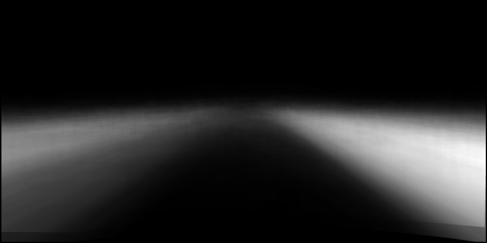

# Segmentation_Stats
Collect various statistics from a semantic segmentation datasets. The program will recursively search for label images and accumulate statistics. This program uses [`cnmem`](https://github.com/NVIDIA/cnmem) for allocation, to grab `95%` of the available GPU memory on startup.

*Notice*: Always use the number of classes plus one. All values higher than number of classes (e.g. 255 for ignore) are grouped into the top class.

There are 3 available stats currently implemented.

## Frequency
This is the total count for each label class.

example output:

| class | count       | 
|-------|-------------| 
| 0     | 5.46547e+07 | 
| 1     | 1.74758e+07 | 
| 2     | 4.44468e+08 | 
| 3     | 461764      | 
| 4     | 1.70721e+07 | 
| 5     | 1.72539e+06 | 
| 6     | 1.69774e+06 | 
| 7     | 2.07309e+06 | 
| 8     | 2.16049e+08 | 
| 9     | 2.01027e+08 | 
| 10    | 3.62953e+08 | 
| 11    | 8.37151e+07 | 
| 12    | 342664      | 
| 13    | 2.44656e+07 | 
| 14    | 3.25476e+06 | 
| 15    | 1.51454e+06 | 
| 16    | 366913      | 
| 17    | 1.24194e+06 | 
| 18    | 1.54103e+06 | 
| 19    | 2.31194e+09 | 
| 20    | 1.9688e+09  | 


## Image Frequency
This is the total count for each label for each image.

example output:
| path     | 0      | 1   | 2      | 3   | 4   | 5   | 6   | 7     | 8      | 9   | 10     | 11  | 12  | 13    | 14  | 15 | 16  | 17  | 18  | 19          | 20          | 
|----------|--------|-----|--------|-----|-----|-----|-----|-------|--------|-----|--------|-----|-----|-------|-----|----|-----|-----|-----|-------------|-------------| 
| img1.png | 709962 | 351 | 806772 | 574 | 325 | 310 | 439 | 412   | 174552 | 510 | 214918 | 120 | 576 | 97949 | 51  | 44 | 81  | 72  | 62  | 9689        | 79383       | 
| img2.png | 0      | 0   | 154973 | 126 | 135 | 192 | 331 | 141   | 14764  | 119 | 85     | 90  | 96  | 327   | 161 | 68 | 114 | 133 | 120 | 1.27981e+06 | 645368      |

## Pixel Frequency
This is the frequency of a class for each pixel location. Note the output is in `exr` format. It can be easily read with `opencv` using the flag `IMREAD_ANYDEPTH | IMREAD_ANYCOLOR`.

Example output (Cityscapes sidewalk calss):


# Build

```
cd /path/to/project
mkdir build
cmake ..
make
```

# Usage

- `-i`: Input folder to recursively search under
  - E.g. `-i /path/to/data`
- `-o`: Output folder to store stats
  - E.g. `-o stat_out/`
- `-e`: Ending to filter by. *No regex or wild cards supported.* [Defalult: `png`]
  - E.g. `-e labelIds.png`
- `-n`: Number of threads to use. Each thread takes up space on GPU. [Default: `8`]
  - E.g. `-n 3`
- `-g`: List of device numbers to use, comma separated. *Currently only one gpu at a time is supported* [Default: `0`]
  - E.g. `-g 0`
- `-c`: Number of classes (Remember to add one class for ignore/255) [Default: `20`]
  - E.g. `-c 5`
- `-h`: Integer height to resize to. Negative number means no resize. [Default: `-1`]
  - E.g. `-h 1024`
- `-w`: Integer height to resize to. Negative number means no resize. [Default: `-1`]
  - E.g. `-w 1024`
- `-f`: Compute Frequency statistic [Default: disabled]
  - E.g. `-f`
- `-p`: Compute Pixel Frequency statistic [Default: disabled]
  - E.g. `-p`
- `-m`: Compute Image Frequency statistic [Default: disabled]
  - E.g. `-m`
- `-a`: Compute all available statistics [Default: disabled]
  - E.g. `-a`

Adding all examples to a single command:

`./SegStats -i /path/to/data -o stat_out/ -e labelIds.png -n 3 -g 0 -c 5 -h 1024 -w 1024 -f -p -m -a`

# Limitations
- All images must be the same size (or resized to be the size).
- Only one GPU is implemented.